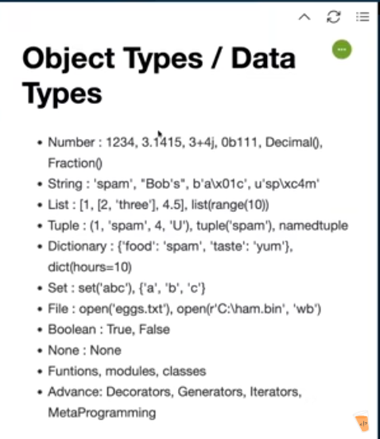

>> 12 + 12
24
>>> 2.5 * 5 
12.5
>>> 2 ** 100
1267650600228229401496703205376 
#  long Values

import math
>>> math.pi 
3.141592653589793
>>> import random 
>>> random.randon()
Traceback (most recent call last):
  File "<stdin>", line 1, in <module>
AttributeError: module 'random' has no attribute 'randon'. Did you mean: 'random'?
>>> random.random() 
0.6817349885368835
>>> random.choice([1,2,4,5])
2   
>>> random.choice([1,2,4,5])
5   
